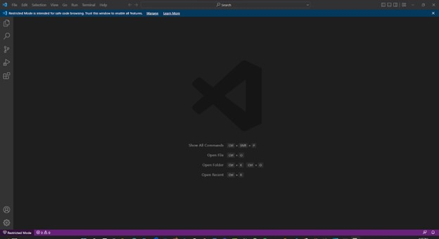
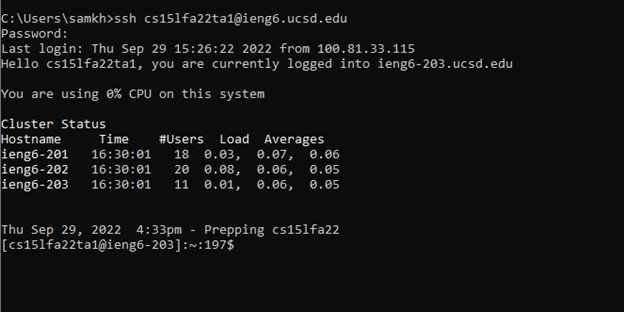
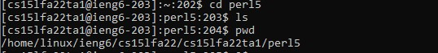
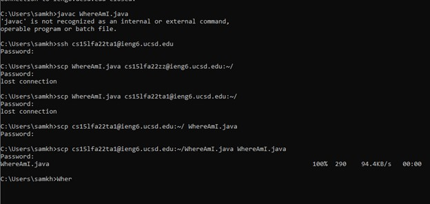
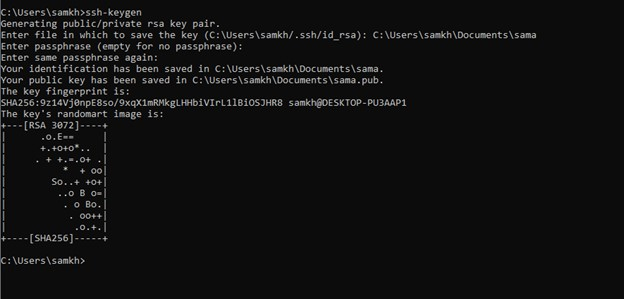
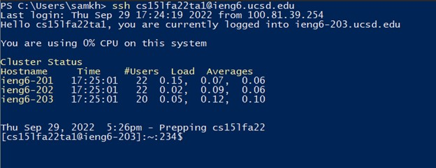

**lab 1**
============

**VS Code Installation**
---

1. I installed VS Code a while ago and i didn't need to go through the steps to install it.
2. In order to install VS Code we can use this [website](https://code.visualstudio.com/).
3. My screenshot is illustrating the initial page of VS Code. 

**Remotely Connecting**
---

1. Because my account didn't work I used one of the TA accounts that they offered in the Lab.  
2. For running the remote account we have to use the secure shell command which is ssh:
```
ssh cs15lfa22<yourGivenInitials>@ieng6.ucsd.edu
```
* note: The password won't be visible to you.
3. After putting the password in, your cmd would look like the screenshot. 

**Trying Some Commands**
---

1. So in this part we run some commands in both Our own computer and the server. The screenshot is an example of running the commands in the server computer. 
2. You may also run the commands in your own computer to compare how your system would run the commands dfferently. 
3. The expected diffrence that you may face is that the commands will run depending on the files you have in the host system. 
In the attached screenshot, I have used the following commands. and you can see what each of them do:
* `cd` : The cd command, also known as chdir (change directory), is a command-line shell command used to change the current working directory in various operating systems.
* `ls` : The ls command is used to list all files and sub-directories in the current directory.
* `pwd` : The pwd command prints the path of the working directory.
* `mkdir` : It is used to make a new directory. 
* `exit` : The exit command terminates the remote access. 
* `cat` : The cat command displays the contents of one or more files without having to open the file for editing.
* `cp` : The cp command is used to copy files or sub-directories to another directory.


**Moving Files with scp**
---

1. The command that we use to move a file form either our own computer to the server or from the server to our own computer is called **secure copy (SCP)**. 
2. So in the last lines of my screenshot you can see that i tried to move the WhereAmI.java file from the server to my own computer. Here are the lines: 
```
C:\users\samkh>scp cs15lfa22ta1@ieng6.ucsd.edu:~/WhereAmI.java WhereAmI.java
Password:
WhereAmI.java
```

3. Then to test and make sure your file has been moved, you can cd the folder you moved your file to. 

**Setting an SSH Key**
---

1. First on your own computer run 'ssh-keygen' then in the line that starts with "Enter file in which ..." rnter your default path.
2. Then sign in normally (ssh your account and enter your password)
3. On your remote server run command 'mkdir .ssh' and you can log out or open another command.
4. the run the following command:
```
scp /users/your pc user/.ssh/id_rsa.pub cs15lfa22<yourGivenInitials>@ieng6.ucsd.edu:~/.ssh/authorized_keys
```
5. You're result should look like something like the attached screenshot.

**Optimizing Remote Running**
---


1. the screenshot shows when you have you're all set up you you don't need to put your password anymore.
2. To extend your optimization you can try to change your WhereAmI.java in your PC. 
3. Then to transfer the file to your remote server you can use the following command:
```
scp WhereAmI.java cs15lfa22<yourGivenInitials>@ieng6.ucsd.edu:~/

```
* **note that if you've set up your key correctly you won't need to put your password in**

Here are the steps
---

1. On your personal computer Make a local edit to WhereAmI.java

2. Use the up arrow twice to get the `scp WhereAmI.java cs15lfajavac<yourGivenInitials>@ieng6.ucsd.edu:~/` command

3. You can write and also use arrow up to run `ssh cs15lfajavac<yourGivenInitials>@ieng6.ucsd.edu` command

4. Run the `javac WhereAmI.java` command

5. Run the `java WhereAmI` command
```
Fri Oct 14, 2022 6:45pm - Prepping cs15lfa22
[cs15lfa22ou@ieng6-203]:~:234$ WhereAmI.java
[cs15lfa22ou@ieng6-203]:~:235$ java WhereAmI 
cs15lfajavacou
/home/linux/ieng6/cs15lfa22/cs15lfa22ou
/home/linux/ieng6/cs15lfa22/cs15lfa22ou
Linux
[cs15lfa22ou@ieng6-203]:~:236$
```